🚀 TravelSafe - Web Application

📖 Descrizione
TravelSafe è un'applicazione web full-stack progettata per aiutare i turisti a muoversi in sicurezza, fornendo informazioni aggiornate sulle zone a rischio, recensioni degli utenti e la possibilità di registrare i propri viaggi con supporto in caso di emergenze.

Ho creato questa app perché, in diverse occasioni, viaggiare da sola mi ha fatto sentire insicura e disorientata, soprattutto senza sapere esattamente dove mi trovassi. TravelSafe vuole essere un compagno affidabile per chiunque ami viaggiare, offrendo una sicurezza in più e la possibilità di affrontare ogni esperienza con maggiore consapevolezza e tranquillità.

Che il tuo prossimo viaggio sia sempre una splendida avventura, con TravelSafe al tuo fianco! ❤️✈️

🛠️ Tecnologie utilizzate

🖥️ Backend
Java 21 con Spring Boot 3.5.3

Spring Security con JWT e OAuth2 Client (login Google)

Spring Data JPA con PostgreSQL

Validation per la validazione dei dati

Spring WebSocket con STOMP e SockJS per notifiche in tempo reale

SpringDoc OpenAPI per documentazione API interattiva

Cloudinary per upload e gestione immagini

MapStruct per mappature DTO (se utilizzato)

Lombok per ridurre boilerplate

Spring Mail per invio email (es. reset password)

DevTools per reload automatico in sviluppo

Test con Spring Boot Starter Test e Security Test

🌐Frontend
React.js + TypeScript

React Router per routing SPA

Leaflet con OpenStreetMap per mappe interattive

React Phone Input per gestione numeri di telefono

Tailwind CSS per styling moderno e responsive (mobile-first)

API REST per comunicazione con backend

WebSocket per notifiche in tempo reale

💻 Funzionamento e utilizzo dell’app

🏗️Architettura Frontend
SPA (Single Page Application) con React.js e TypeScript

Routing dinamico con React Router per navigare senza ricaricare la pagina

Componenti modulari e riutilizzabili organizzati nelle cartelle /Pages e /components

Styling responsive con Tailwind CSS e gestione temi e gradienti

---

✨ Funzionalità principali

🔐 Autenticazione e Profilo Utente
Registrazione e login tramite form con validazione

Accesso rapido tramite Google OAuth2

Gestione dello stato di autenticazione con Context API

Token JWT salvato in localStorage

## Visualizzazione e modifica dei dati profilo, incluso upload e anteprima immagini tramite Cloudinary

🧳Gestione Viaggi

Form per inserire e registrare viaggi con campi dinamici

Autocomplete geolocalizzato tramite API Nominatim

## Mappa interattiva con Leaflet per visualizzare i luoghi del viaggio

⚠️ Zone a Rischio

Visualizzazione interattiva delle zone a rischio con cerchi colorati su mappa Leaflet

## Ricerca città con autocomplete

⭐ Recensioni

Inserimento, modifica e cancellazione recensioni con rating a stelle

## Funzionalità per admin di rispondere alle recensioni

🔔 Notifiche in tempo reale

Ricezione di notifiche push tramite WebSocket (SockJS + STOMP) senza ricaricare la pagina

############################################################################

🚀 Come utilizzare l’app TravelSafe

✅ Prerequisiti
Avere un account (registrazione o accesso con Google)

Connessione internet per accedere alle mappe e API geolocalizzate

📝 Passaggi base
👤 Registrati o accedi
Puoi creare un account inserendo email e password oppure accedere rapidamente tramite Google. Dopo il login, il tuo token JWT verrà salvato per mantenere la sessione attiva.
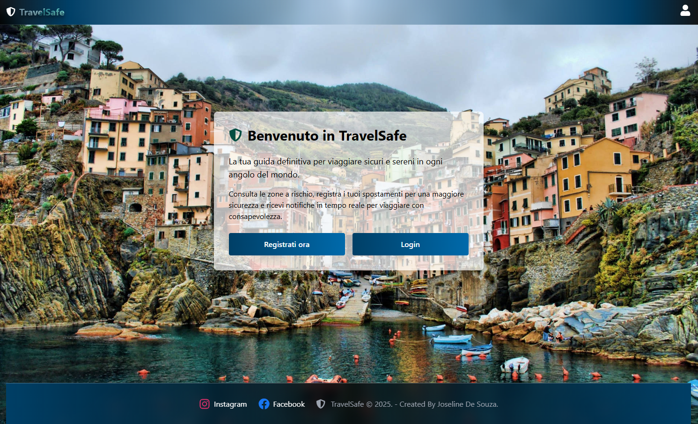

🏠 Home page
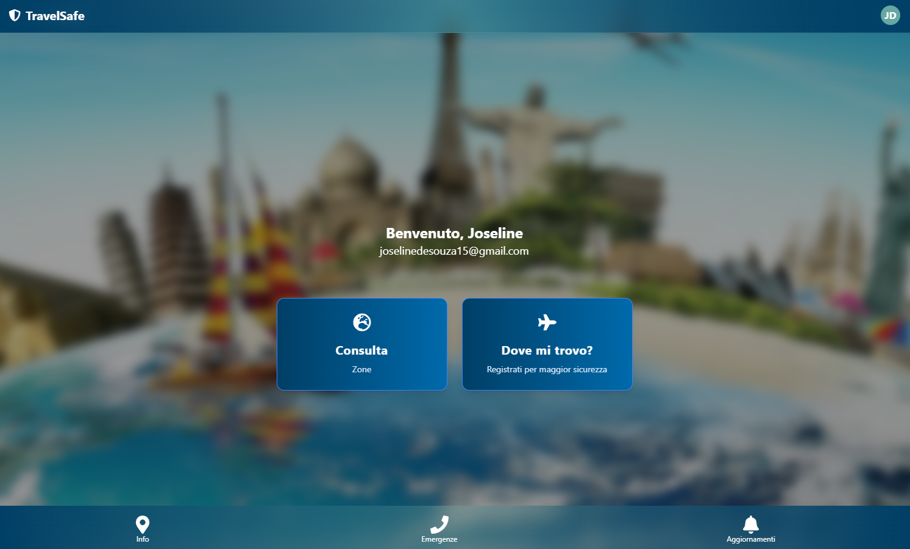

🖼️ Completa il tuo profilo
Accedi alla pagina profilo per aggiornare i tuoi dati personali e caricare un’immagine profilo.
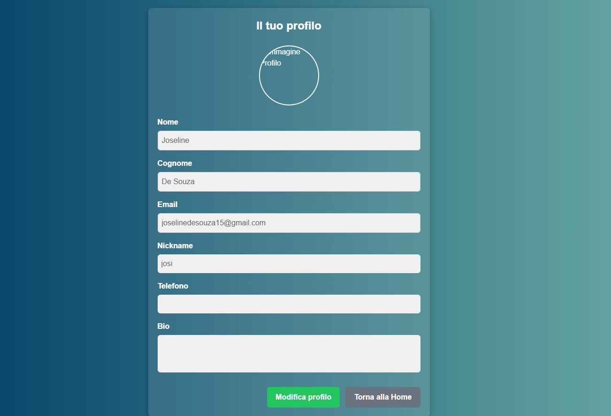

🗺️ Consulta le zone a rischio
Usa la mappa interattiva per visualizzare le zone a rischio nella città o area di tuo interesse. Puoi cercare la città tramite il campo di ricerca con autocomplete.
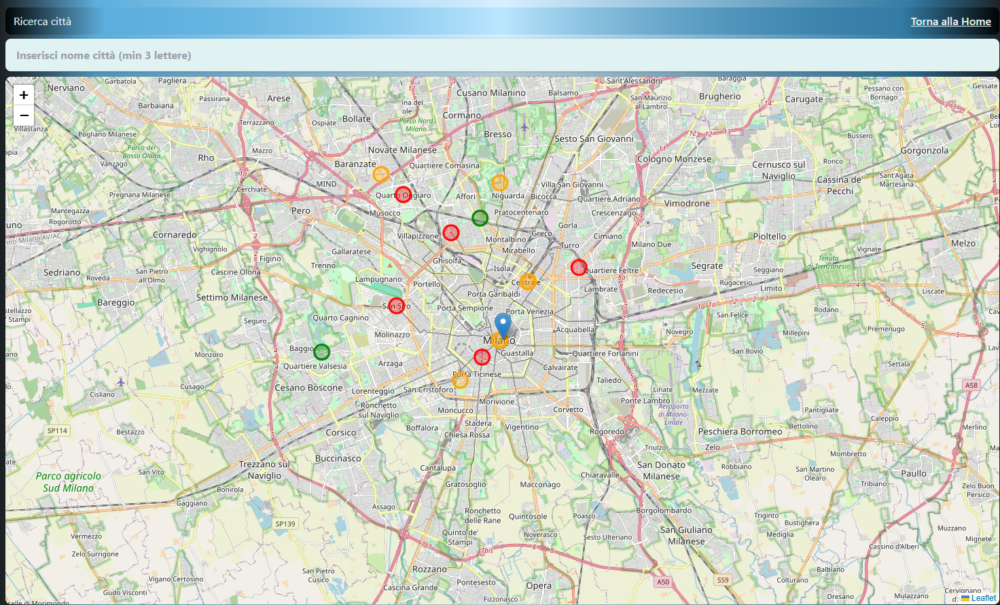

✈️ Registra i tuoi viaggi
Inserisci i dettagli del tuo viaggio, usando l’autocomplete geolocalizzato per indicare i luoghi visitati. Potrai visualizzare il viaggio sulla mappa interattamente, questo ti permetterà di sentirti anche più al sicuro.
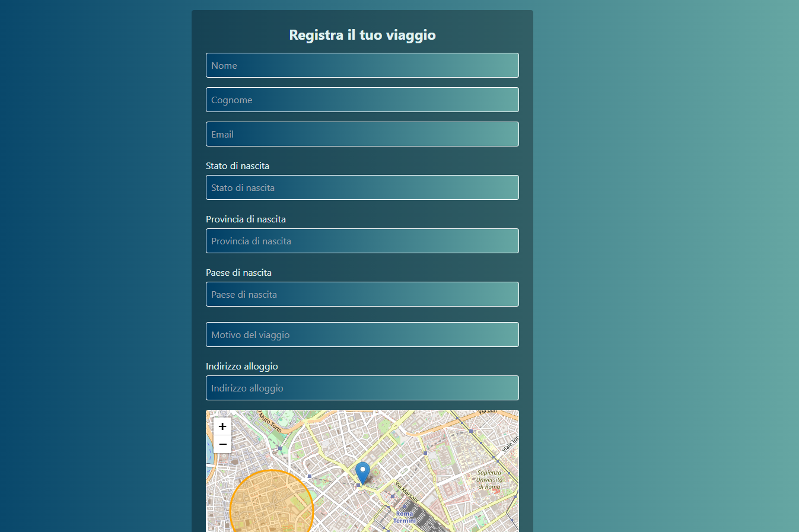
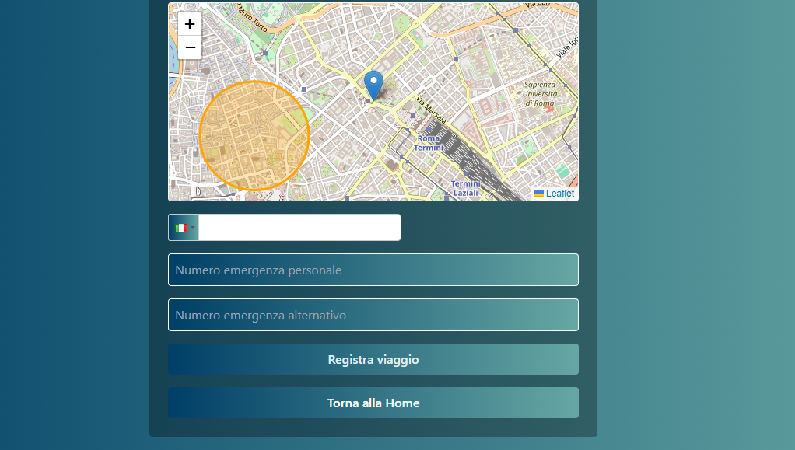

💬 Leggi e scrivi recensioni
Consulta le recensioni di altri utenti sulle varie zone o punti di interesse e lascia il tuo feedback, con voti a stelle e commenti, queste recensioni innoltre permetterano a chi gestisce la pagina di rimane aggiornato sulle varie città in modo da poter aggiungere o togliere il rischio di ognuna di essa..
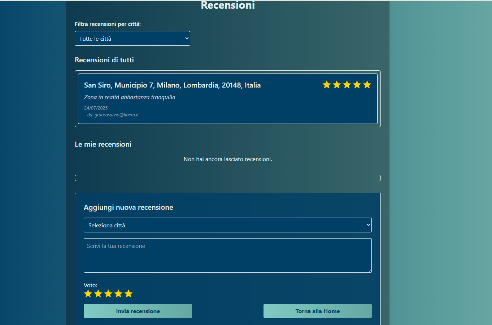

ℹ️ Sezione INFO
Troverai una guida con le informazioni in caso di emergenza in fonod sulla mappa troverai anche i commisariati/caserme più vicine alla tua posizione, e cliccandoci sopra sulla voce mostra indicazioni si aprira google maps per poterti guidare fino al punto da te scelto
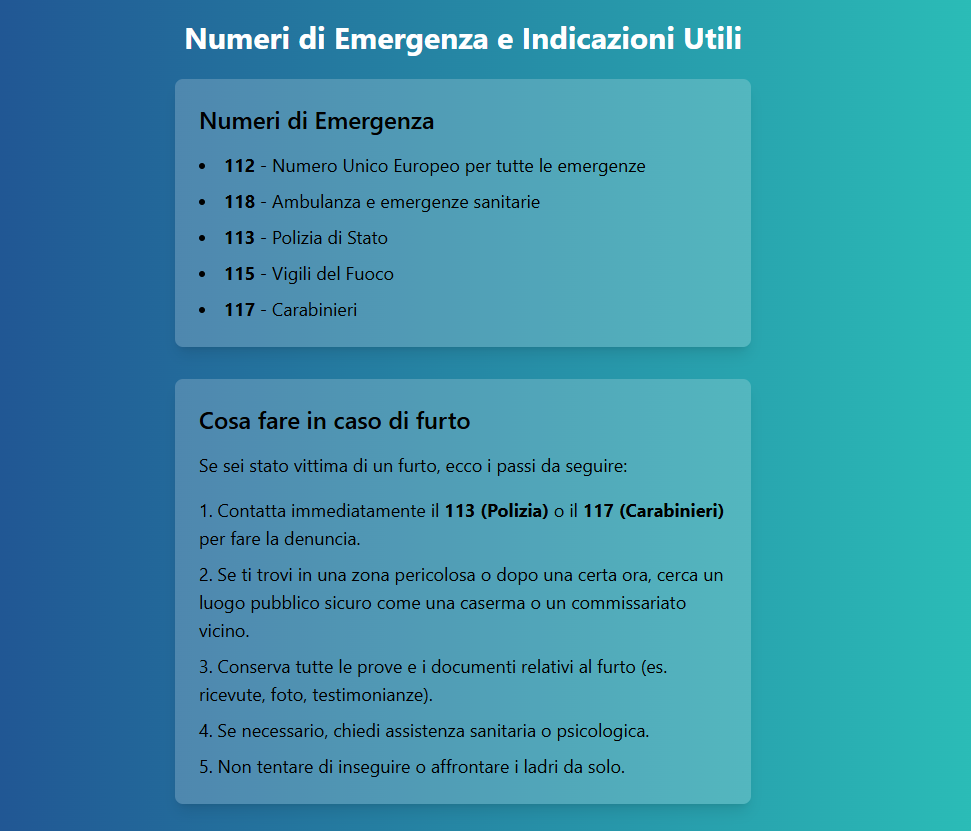
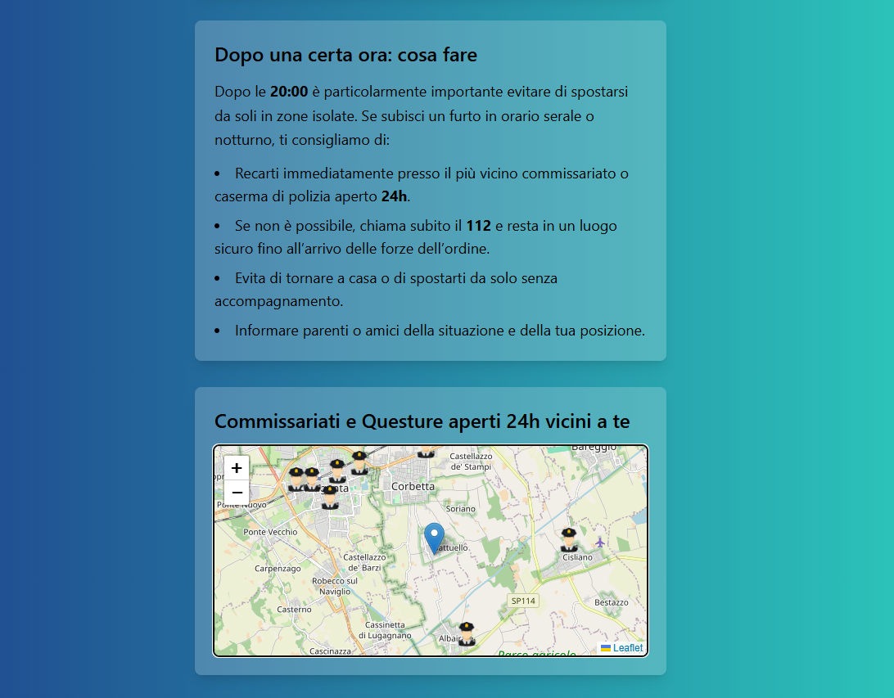
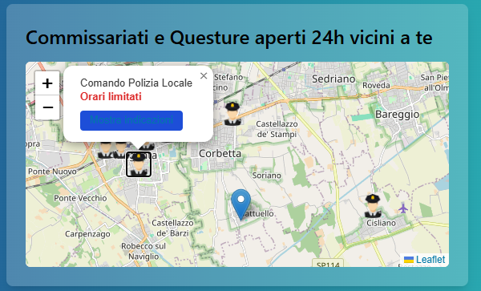

🚨 Sezione EMERGENZE
Entrando sulla voce EMERGENZE invece troverai una mappa con tutti i punti di emergenza necessari i quali ospedali,farmacie e forze dell'ordine, troverai anche il tasto con la chiamata diretta al 112 ed inoltre hai la possibilita di registrare la tua posizione esatta in caso di un'emergenza che richiede di spostarti dal posto nel quale ti trovi, in modo che una volta arrivati chi di dovere saprai dirle con certezza il posto dell'accaduto.
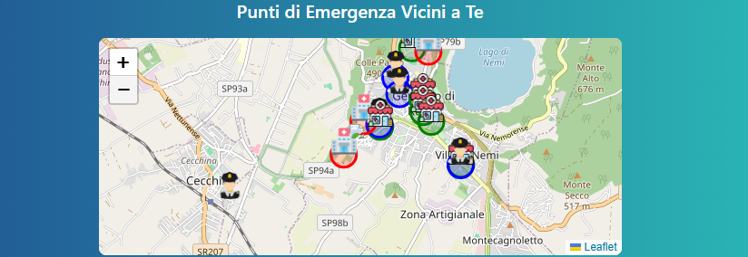
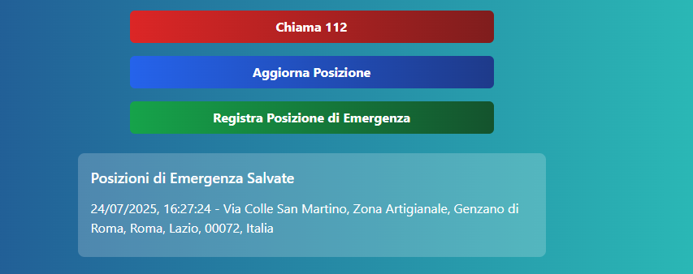
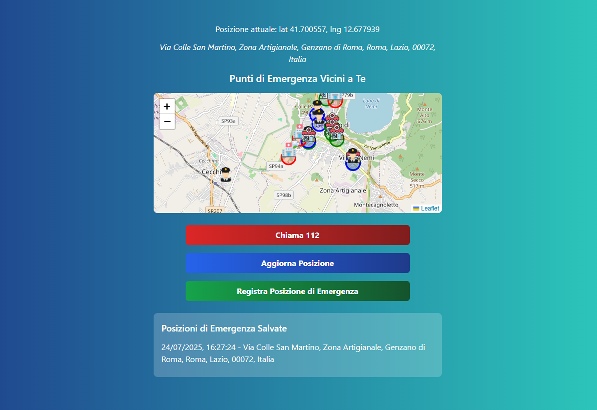

📰 Sezione AGGIORNAMENTI
Entrando sulla voce AGGIORNAMENTI troverai una campo serch che ti permettera di cercare le news in base alla CITTA dove ti trovi, in modo che tu possa sempre rimanere aggiornato!
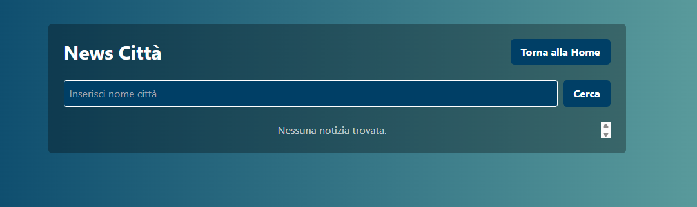
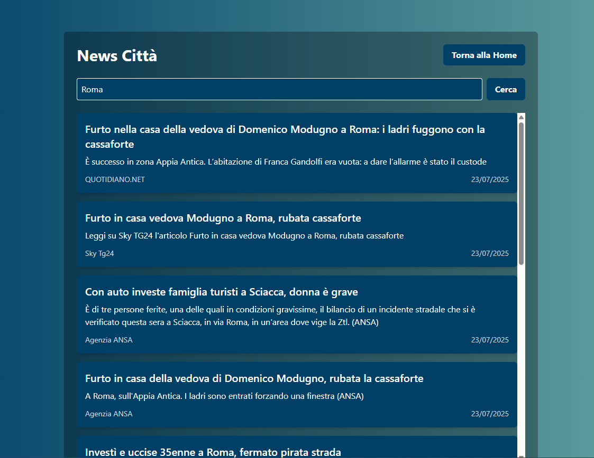

🛠️ Guida e Supporto
Guida e Supporto nella bar latterale che si apre cliccando l'iconcina del tuo profilo troverai questo campo,
una volta cliccato ti permettare di avere le informazioni giuste per la guida ed il supporto, innoltre ti fara vedere come eliminare il tuo profilo qualora lo volessi fare devi solo seguire le istruzioni, che richiedono un motivo a questa "eliminazione" in questo caso i tuoi dati saranno rimossi e cancellati dalla pagina..
Dicioso "MOTIVO" perchè è importante? è importante perchè arriva direttamente a chi gestisce la pagina e può essere utile per migliorie della stessa.
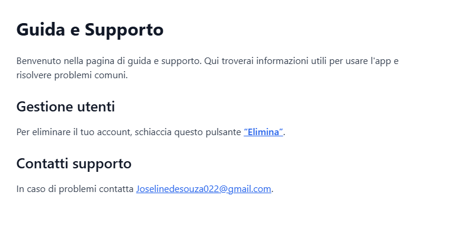
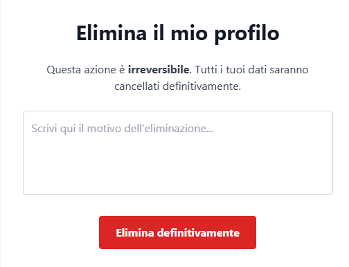

---

📞 Contatti
Creato da Joseline De Souza
Email: joselinedesouza@gmail.com
Tel: +39 371 359 4430

GitHub backend: https://github.com/Joselinedesouza/travelsafebackend
